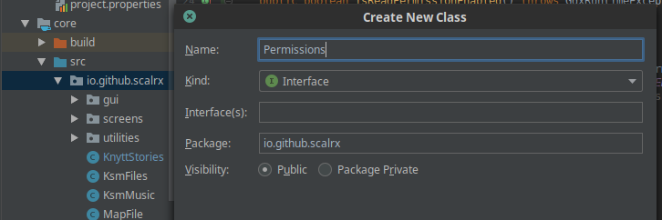
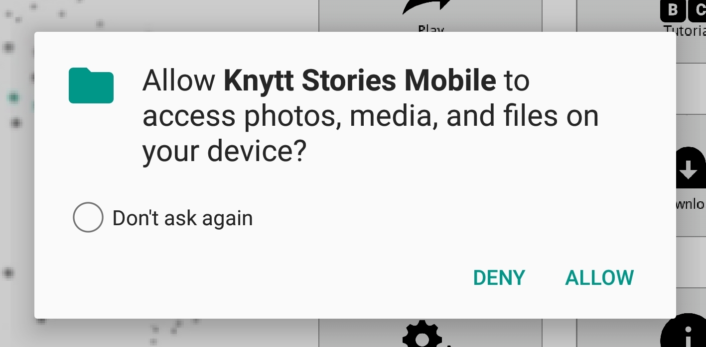

# Requesting Android Runtime Permissions in LibGDX

An interesting problem that I ran into while developing Knytt Stories Mobile is how exactly to request permissions such as the ability to read and write to the phone's external storage. Prior to Android API 23, developers were able to simply slip permissions into the `AndroidManifest.xml` file like so:

```xml
<!-- Android Manifest file -->
<uses-permission android:name="android.permission.READ_EXTERNAL_STORAGE" />
<uses-permission android:name="android.permission.WRITE_EXTERNAL_STORAGE"/>
<!-- Rest omitted for clarity -->
```

Devices running Android 6.0 (Lollipop) and beyond require that any app using Android API 23 or higher to utilize runtime permissions for any permissions deemed "[dangerous](https://developer.android.com/guide/topics/permissions/overview#special_permissions)". Additionally, Google Play requires **at least** API 26 at the time of this writing. Obviously, an app requesting permissions to be able to read/write/alter the files on a user's device has the potential to be highly dangerous and it's important to responsibly use these abilities; otherwise the user may become averse and remove the app.

Given that LibGDX is a cross-platform framework that can be used on Android devices, how does one programmatically check or request permissions on Android devices since developing applications on LibGDX is so different from a run-of-the-mill Android application? [Other individuals have asked this question prior](https://stackoverflow.com/questions/53716107/runtime-user-permissions-on-android-api-26), but no solution was ever provided. The answer is simple, but not that obvious. We will need to make some changes to the Android launcher for the LibGDX application, as this is our single entry point on Android.

### How

First, we will need to create an `interface` in our application that can handle permissions. Within the `core` folder of your project, create a Java `interface` in somewhere such as the main package, or utilities package.



I will call this interface `Permissions` and will refer to it as such for the remainder of the tutorial. Within this `interface`, declare the members and methods you'd like to use for it. For example:

```Java
public interface Permissions {
    boolean isReadPermissionEnabled();
    boolean isWritePermissionEnabled();
}
```
> Beginning with Java 9, you can create private methods. However, the version of Java used with this tutorial was Java 7, meaning all methods/members must be public.

Suppose I want to handle read and write permission checks. Above are some sample methods I will use to do so. While these can be checked jointly, I have split them into two separate checks for diversity. Since an `interface` is abstract, we will need to implement these methods separately.

Venture to your project's `android/src/package.name.here` folder and open the `AndroidLauncher.java` file. We will use the `AndroidLauncher` class to implement the `Permissions` interface. You should see something like this at the start:

```Java
/*  BEFORE  */
public class AndroidLauncher extends AndroidApplication {
	@Override
	protected void onCreate (Bundle savedInstanceState) {
		super.onCreate(savedInstanceState);
		AndroidApplicationConfiguration config = new AndroidApplicationConfiguration();
		initialize(new KnyttStories(), config);
	}
```
We need to change the above to the following:
```Java
/*  AFTER  */
public class AndroidLauncher extends AndroidApplication implements Permissions {
	@Override
	protected void onCreate (Bundle savedInstanceState) {
		super.onCreate(savedInstanceState);
		AndroidApplicationConfiguration config = new AndroidApplicationConfiguration();
		initialize(new KnyttStories(this), config);
	}
```
Here, we choose the `AndroidLauncher` to implement the `Permissions` interface, and we also need to pass the `AndroidLauncher` to our application constructor. (The 7th line, I pass `this` to the KnyttStories constructor.) This is because we need to have the `core` application to have access to our Android-exclusive goodies.

From here, we will implement the methods from Permissions here in `AndroidLauncher.java`:

```Java
    /* Implementation to determine if the permissions are enabled */
    @Override
    public boolean isReadPermissionEnabled(){
        int currSDKVersion = Build.VERSION.SDK_INT;
        // Lollipop-specific check
        if(currSDKVersion > Build.VERSION_CODES.LOLLIPOP_MR1) {
            // Get the return code for if we have the permission
            int permissionResult = checkSelfPermission(Manifest.permission.READ_EXTERNAL_STORAGE);
            if(permissionResult != PackageManager.PERMISSION_GRANTED) {
                requestReadPermission();
            } else {
                return true;
            }
        }
        return false;
    }

    @Override
    public boolean isWritePermissionEnabled() {
        int currSDKVersion = Build.VERSION.SDK_INT;
        // Lollipop-specific check
        if(currSDKVersion > Build.VERSION_CODES.LOLLIPOP_MR1) {
            // Get the return code for if we have the permission
            int permissionResult = checkSelfPermission(Manifest.permission.WRITE_EXTERNAL_STORAGE);
            if(permissionResult != PackageManager.PERMISSION_GRANTED) {
                requestWritePermission();
            } else {
                return true;
            }
        }
        return false;
    }

    /* Helper-method Request functions */
    private void requestReadPermission() {
        int currSDKVersion = Build.VERSION.SDK_INT;
        // Lollipop-specific check
        if(currSDKVersion > Build.VERSION_CODES.LOLLIPOP_MR1) {
            requestPermissions(new String[]{Manifest.permission.READ_EXTERNAL_STORAGE}, 100);
        }
    }

    private void requestWritePermission() {
        int currSDKVersion = Build.VERSION.SDK_INT;
        // Lollipop-specific check
        if(currSDKVersion > Build.VERSION_CODES.LOLLIPOP_MR1) {
            requestPermissions(new String[]{Manifest.permission.WRITE_EXTERNAL_STORAGE}, 101);
        }
    }
```

So what did we do here? I create some `boolean` functions to check if we have read permissions and write permissions. There are also some `private` helper functions to pop up the request window if it's discovered we don't have the appropriate permissions. In particular, because runtime permissions are required only for Android API 23 and later, we must make sure that the check only occurs for these kinds of devices:

```Java
    int currSDKVersion = Build.VERSION.SDK_INT;
    if(currSDKVersion > Build.VERSION_CODES.LOLLIPOP_MR1)
        // ...
```
Since we are passing the `AndroidLauncher` to the main class constructor, this allows us to accept Android-only data into the program (e.g., the `Permissions`). Thus, we need to go to our main game class and create appropriate constructors for passing in these permissions.

> This next section assumes that you have a desktop launcher as well.

In your main class (For me, it's in `KnyttStories.java`), you will need to create two constructors:

```Java
    // Desktop Constructor
	public KnyttStories() {
		super();
	}
	// Android Constructor
	public KnyttStories(Permissions permissions) {
        super();
		this.permissions = permissions;
	}
	// For Android
    private Permissions permissions;
	public Permissions getPermissions() {
    	return permissions;
	}
```
One constructor for desktop, and the other for Android (you may write others if you so choose). You want to create a `private` member to hold the Permissions object and a method to return it when needed. From here, you should be able to programmatically call for Permissions from your game class.

For example, I want to check for these permissions on the Main Menu screen. I decide to do so in the `show()` method:

```Java
@Override
public void show() {
    if(Gdx.app.getType() == Application.ApplicationType.Android) {
        if(!game.getPermissions().isReadPermissionEnabled()) {

            game.getPermissions().requestReadPermission();
        }
        if(!game.getPermissions().isWritePermissionEnabled()) {
            game.getPermissions().requestWritePermission();
        }
    }
}
```

Obviously, we need to check to make sure the check only occurs on Android platforms. If we actually run the game on Android, we should see the following message appear upon loading of the main menu:



### Conclusions

While programmatically getting Android permissions in a LibGDX app doesn't require much code, there are many hoops the programmer has to jump through in order to get the simple solution. **Additionally**, one should ensure checks periodically through program execution to make sure permissions are still valid, as the user is able to revoke permissions at any time--this is bad as the program may not execute as expected if it can't get what it needs. In my situation, Knytt Stories Mobile requires access to internal files and user-provided files, which means that reading and writing to the external storage is vital for the game to work properly. My hope with this tutorial is to save others hours of Googling. At the time of this writing, all other resources for handling Android-only goodies in LibGDX were incredibly vague and not very helpful. If you liked this tutorial, [please give Knytt Stories Mobile project a star on GitHub](https://github.com/scalrx/knytt-stories-mobile)!
